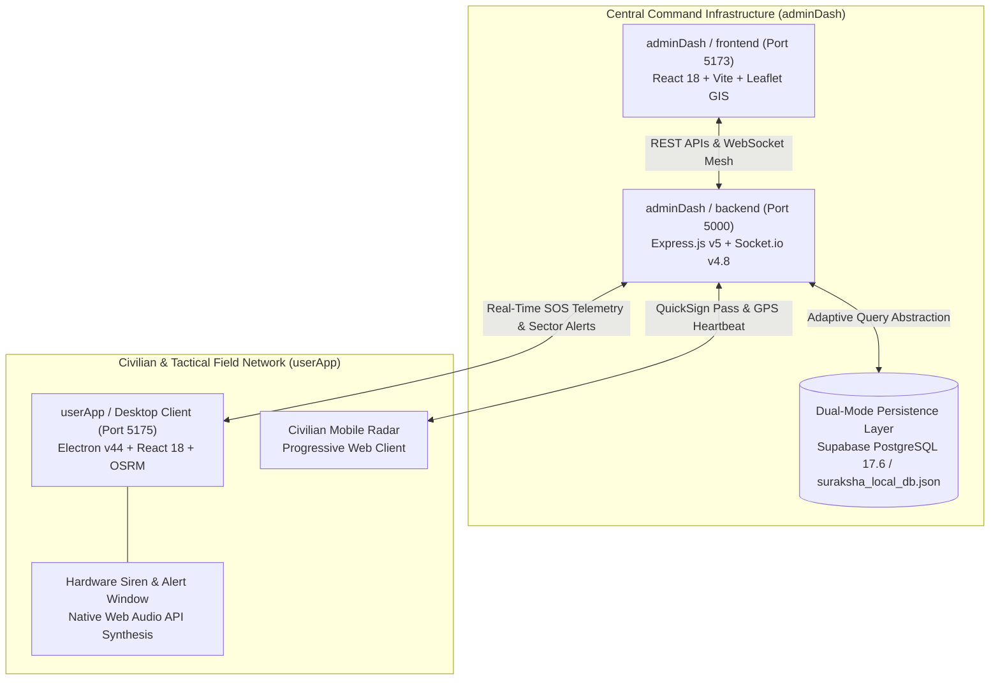

<div align="center">

<!-- Animated Header Wave with Title -->


<!-- Animated Dynamic Typing Banner -->


<pre align="center">
███████╗██╗   ██╗██████╗  █████╗ ██╗  ██╗███████╗██╗  ██╗ █████╗ ██████╗ ██████╗ ██╗███████╗██╗  ██╗████████╗██╗
██╔════╝██║   ██║██╔══██╗██╔══██╗██║ ██╔╝██╔════╝██║  ██║██╔══██╗██╔══██╗██╔══██╗██║██╔════╝██║  ██║╚══██╔══╝██║
███████╗██║   ██║██████╔╝███████║█████╔╝ ███████╗███████║███████║██║  ██║██████╔╝██║███████╗███████║   ██║   ██║
╚════██║██║   ██║██╔══██╗██╔══██║██╔═██╗ ╚════██║██╔══██║██╔══██║██║  ██║██╔══██╗██║╚════██║██╔══██║   ██║   ██║
███████║╚██████╔╝██║  ██║██║  ██║██║  ██╗███████║██║  ██║██║  ██║██████╔╝██║  ██║██║███████║██║  ██║   ██║   ██║
╚══════╝ ╚═════╝ ╚═╝  ╚═╝╚═╝  ╚═╝╚═╝  ╚═╝╚══════╝╚═╝  ╚═╝╚═╝  ╚═╝╚═════╝ ╚═╝  ╚═╝╚═╝╚══════╝╚═╝  ╚═╝   ╚═╝   ╚═╝
</pre>

<br/>

<!-- System Telemetry & Authority Badges -->
<p align="center">
  <a href="https://smartindiahackathon.gov.in">
    
  </a>
  &nbsp;
  <a href="https://ndrf.gov.in">
    
  </a>
  &nbsp;
  <a href="#core-system-capabilities">
    
  </a>
  &nbsp;
  <a href="https://github.com/Babin123456/SurakhshaDrishti">
    
  </a>
</p>

<!-- Problem Statement Card -->
> **SIH Problem Statement 26191**: *Intelligent Identification of Hazard-Based Red Zones, Dynamic Carrying Capacity Assessment of Safer Relocation Sites, and Immediate Prioritization of Vulnerable Habitations.*

</div>

---

## 1. System Overview & Executive Architecture

**SurakshaDrishti** is a mission-critical, AI-driven disaster decision support system (DSS) engineered to predict, delineate, and de-escalate acute geological and meteorological hazard perimeters (flash floods, landslides, and storm surges). Built to serve **National Disaster Response Force (NDRF)** battalions, **State Disaster Management Authorities (SDMA)**, District Emergency Operations Centers (EOCs), and frontline civilians, the platform bridges real-time spatial telemetry with actionable civilian evacuation corridors.

The ecosystem is architecturally decoupled into two operational nodes communicating over a high-throughput, low-latency API and WebSocket mesh:



---

## 2. Core Operational Platforms

### 2.1 `adminDash` — The Central Command Console (`Port 5000` / `Port 5173`)
Located in [`adminDash/`](./adminDash), this platform delivers military-grade situational intelligence and operational governance for emergency directors and field commanders:

- **Adaptive Backend Engine (`adminDash/backend`)**:
  - Operates on Node.js v20+ with Express.js v5 on `http://localhost:5000`.
  - **Dual-Mode Persistence (`dbHandler.js`)**: Connects to cloud Supabase PostgreSQL 17.6 with automatic, zero-downtime failover to `suraksha_local_db.json`. In offline fallback, queries hot-reload directly from disk on every invocation, allowing air-gapped field deployment on disaster-site laptops.
  - **Emergency Telemetry Upsert**: Ingests high-frequency GPS coordinate pings (`POST /api/zones/update-location`) and updates persistent tracking tokens (`LOC-userId`) without database bloat.
  - **Zero-Friction QuickSign Engine (`POST /api/auth/quicksign`)**: Issues 30-second digital evacuation passes, querying shelters by net available capacity and bypassing traditional 2FA barriers during sudden crises.

- **Central Command GIS Dashboard (`adminDash/frontend`)**:
  - High-performance React 18 & Vite 5 web interface served on `http://localhost:5173`.
  - Styled with a warm creme and dark matte slate palette with custom paper texture overlays and 3D Apple-inspired interface cards.
  - **16-Digit Cryptographic Red Zone Key (`Assign Self to Red Zone`)**: Enforces localized zero-trust access control. Commanders must verify sector jurisdiction using rolling keys (e.g. `RZ-99B2-3C44-1D7F`) before unlocking tactical voting or inter-agency chat.
  - **Assigned Inter-Agency Deployment Roster**: Real-time multi-agency transparency tracking active officers across NDRF, SDMA, Police, Fire, and Medical battalions.
  - **Multi-Agency Consensus De-escalation Protocol**: Prevents premature or unilateral declaration of safety in volatile zones. Sectors require a defined consensus threshold (e.g., 3 affirmative officer votes) before transitioning from `ACTIVE_RED_ZONE` to `SITUATION_UNDER_CONTROL (RESOLVED SAFE)`.
  - **Tactical Actions**: One-click geo-fenced siren broadcast alerts and priority reinforcement dispatch beacons.
  - **Interactive 37-Module FAQ & Knowledge Center**: Searchable technical documentation answering architectural, operational, and algorithmic questions.

### 2.2 `userApp` — Civilian Incident Radar & Field Client (`Port 5175`)
Located in [`userApp/`](./userApp), this client operates as a cross-platform Electron v44 desktop application and standalone web application:

- **Proximity Geofencing & Blast Radius Detection**: Continuously computes Haversine distances against all active hazard perimeters. Renders danger zones dynamically only when users are in danger vicinity, preventing unnecessary panic.
- **Standalone Emergency Warning Window & Web Audio Siren**: Spawns an independent, frameless, always-on-top alert window using hardware speaker audio oscillation (`800Hz ↔ 600Hz` square-wave tone) that requires explicit acknowledgment.
- **Dynamic Street Evacuation Corridors (OSRM Engine)**: Real-time driving and walking routes plotted to assigned relief hubs via Open Source Routing Machine, with straight-line vector fallbacks during network degradation.
- **Offline H3 Geohash Pathfinding**: Resolves cell-adjacency routes across Uber's H3 hexagonal hierarchical spatial index, enabling navigation without cellular data.
- **Automated GPS Heartbeat Loop**: While emergency mode is engaged, transmits 30-second telemetry updates to `/api/zones/update-location`, projecting live distress beacons onto central command radar displays.

---

## 3. Technology Stack & Service Matrix

<div align="center">

| Layer | Technologies & Frameworks | Port / Protocol | Key Responsibilities |
| :--- | :--- | :--- | :--- |
| **Command Backend** | Node.js v20+, Express.js v5, Socket.io v4.8 | `HTTP: 5000` / `WSS` | Central API, WebSocket relay, dual-mode DB abstraction, telemetry |
| **Command Frontend** | React 18, Vite 5, TailwindCSS v3, Leaflet v1.9 | `HTTP: 5173` | EOC Tactical GIS map, consensus voting, inter-agency roster, 37 FAQs |
| **UserApp Client** | Electron v44, React 18, Vite 5, TailwindCSS v3 | `HTTP: 5175` / `IPC` | Civilian HUD, OSRM routing, Web Audio siren, field GPS beacon |
| **Database & Cache** | Supabase PostgreSQL 17.6 + Local JSON Fallback | `Port 5432` / `Disk` | Relational tables, spatial geometries, hot-reloading mock store |
| **Spatial Indexing** | Uber H3 Hexagonal Grid, Google S2, 8-Char Geohash | Sub-meter / Hex | Discrete spatial cell indexing, adjacency pathfinding, hazard buffers |
| **Routing Engine** | OSRM (Open Source Routing Machine), Leaflet Polylines | OpenStreetMap | Real-time driving corridors, street geometry, turn-by-turn vectors |
| **Cryptography** | AES-256-GCM, ECDH Key Exchange, bcrypt | Cryptographic Hash | 16-Digit sector keys, E2EE inter-agency communications, hashed tokens |

</div>

---

## 4. Key Architectural Innovations & Technical Highlights

```
┌────────────────────────────────────────────────────────────────────────────────────────┐
│                               SURAKSHADRISHTI CORE NOVELTY                             │
├──────────────────────────────┬─────────────────────────────┬───────────────────────────┤
│    ZERO-TRUST 16-DIGIT KEY   │  CONSENSUS RESOLUTION VOTE  │   QUICKSIGN 30-SEC SOS    │
│  Localized command isolation │ Multi-agency 80% consensus  │  2FA-bypassed safe haven  │
│ prevents unauthorized sector │ eliminates unilateral human │  assignment by real-time  │
│     order dispatching.       │    premature de-escalation. │     carrying capacity.    │
├──────────────────────────────┼─────────────────────────────┼───────────────────────────┤
│    DUAL-MODE PERSISTENCE     │   OSRM CORRIDOR ROUTING     │   HARDWARE WEB AUDIO      │
│ Transparent Postgres-to-JSON │  Dynamic street evacuation  │  Asset-independent native │
│ hot-reloading for air-gapped │ avoiding hazard circles and │   emergency siren tone    │
│   field laptop deployment.   │    bottlenecked camps.      │     oscillator (800Hz).   │
└──────────────────────────────┴─────────────────────────────┴───────────────────────────┘
```

1. **Dynamic Carrying Capacity & Evacuation Balancing**:
   Rather than funneling all evacuees to the single nearest shelter, the backend sorts verified relief shelters by net remaining headroom (`(capacity_total - capacity_occupied) DESC`). Overcrowded centers are automatically throttled, distributing civilian traffic across regional hubs.

2. **Dual-Mode Resilient Database Layer (`dbHandler.js`)**:
   Standard disaster systems collapse when internet or cloud databases drop offline. SurakshaDrishti embeds a resilient proxy that executes queries against PostgreSQL when reachable, and seamlessly shifts to `suraksha_local_db.json` when disconnected. Crucially, it reloads disk data on every call, enabling manual or external sector adjustments without restarting the service.

3. **End-to-End SOS Heartbeat Pipeline**:
   Civilians generate verified temporary passes (`QS-XXXXXX`) within 30 seconds. A background JavaScript worker transmits coordinates every 30 seconds to `/api/zones/update-location`. The backend performs atomic upserts on `LOC-userId` tokens, rendering live civilian radar markers with contact information, family size, and special medical needs (infant, wheelchair, oxygen) directly on the EOC tactical map.

4. **Multi-Agency Consensus De-escalation**:
   Resolving a Red Zone requires an authenticated quorum of assigned field authorities. Once affirmative consensus is verified, the system automatically transitions the sector to `SITUATION_UNDER_CONTROL`, recalculates evacuation routes, and broadcasts all-clear notifications across the civilian mesh.

---

## 5. Repository Structure

```text
SurakshaDrishti/
├── adminDash/                               # Central Command & Core API
│   ├── backend/                             # Core Express & Socket.io Service
│   │   ├── database/
│   │   │   ├── schema.sql                   # Complete PostgreSQL schema (165 lines)
│   │   │   └── suraksha_local_db.json       # Resilient local JSON fallback store
│   │   ├── handlers/
│   │   │   └── dbHandler.js                 # Dual-mode DB proxy with hot-reload
│   │   ├── routes/
│   │   │   ├── auth.js                      # Login, 2FA OTP, QuickSign SOS passes
│   │   │   ├── chat.js                      # Inter-agency tactical message relay
│   │   │   ├── feedback.js                  # Public situational reports & feedback
│   │   │   ├── profile.js                   # Officer profile management & 2FA
│   │   │   └── zones.js                     # Hazard zones, consensus voting, GPS pings
│   │   ├── src/
│   │   │   └── main.js                      # Express server entry point (Port 5000)
│   │   └── package.json
│   ├── frontend/                            # React 18 Command Web Dashboard
│   │   ├── src/
│   │   │   ├── components/
│   │   │   │   ├── GovernmentLanding.jsx    # Central command hero & authentication portal
│   │   │   │   ├── InteractiveMap.jsx       # Tactical Leaflet GIS with layer switcher
│   │   │   │   ├── Navbar.jsx               # Navigation bar & officer status indicator
│   │   │   │   ├── QuickSignModal.jsx       # Zero-friction 30-second SOS pass modal
│   │   │   │   ├── pages/
│   │   │   │   │   ├── Faqs.jsx             # 37 Interactive technical FAQ modules
│   │   │   │   │   ├── Documentation.jsx    # System specifications and manuals
│   │   │   │   │   ├── PrivacyPolicy.jsx    # Data governance & cryptographic rules
│   │   │   │   │   └── TermsOfService.jsx   # Standard operating terms
│   │   │   │   └── ...
│   │   │   ├── App.jsx                      # Root application layout coordinator
│   │   │   └── main.jsx
│   │   ├── vite.config.js                   # Configured for Port 5173
│   │   └── package.json
│   └── README.md                            # Comprehensive adminDash manual
├── userApp/                                 # Civilian & Field Tactical App
│   ├── backend/
│   │   ├── main.cjs                         # Electron main process & IPC window handlers
│   │   └── preload.cjs                      # Context-isolated Electron bridge
│   ├── frontend/
│   │   ├── src/
│   │   │   ├── components/
│   │   │   │   ├── UserDashboard.jsx        # Civilian Radar Console & HUD
│   │   │   │   ├── AgentDashboard.jsx       # Field tactical unit dispatch console
│   │   │   │   ├── RealGoogleMap.jsx        # Leaflet GIS with OSRM evacuation corridors
│   │   │   │   ├── AlertNotification.jsx    # Standalone emergency warning window
│   │   │   │   └── AppLogin.jsx             # Resident mobile login & Officer 2FA
│   │   │   ├── App.jsx
│   │   │   └── vite.config.js               # Configured for Port 5175
│   │   └── package.json
│   ├── package.json                         # Electron launch and build scripts
│   └── README.md                            # Comprehensive userApp manual
├── ai_prediction_architecture.md            # Deep learning ConvLSTM / ViViT specifications
├── TECH_WOW_AND_NOVELTY.md                  # Comprehensive novelty & innovation whitepaper
├── ROADMAP.md                               # Strategic feature roadmap & security blueprint
├── LICENSE                                  # MIT Open-Source License
└── README.md                                # Master System Documentation
```

---

## 6. Database Schema Architecture

The relational data backbone operates on **Supabase PostgreSQL 17.6** (with transparent fallback to `suraksha_local_db.json`):

| Table | Primary Keys & Indexes | Primary Operational Responsibility |
| :--- | :--- | :--- |
| `users` | `user_id` (PK), `email` (Unique) | Officer and resident profiles, agency roles (`NDRF`, `SDMA`, `POLICE`), 2FA hashes, coordinates. |
| `hazard_zones` | `zone_id` (PK), `access_key` | AI hazard perimeters, risk scores (0–100), H3/S2 spatial geohashes, and 16-digit security keys. |
| `zone_assignments` | `assignment_id` (PK) | Inter-agency battalion assignments, on-duty timestamps, and consensus resolution votes. |
| `shelters` | `shelter_id` (PK) | Relief hub coordinates, carrying capacities, current bed occupancy, and status (`OPEN`/`FULL`). |
| `emergency_passes` | `pass_id` (PK) | QuickSign tokens (`QS-XXXXXX`), GPS tracking tokens (`LOC-userId`), and special vulnerability flags. |
| `e2ee_conversations`| `conversation_id` (PK) | Cryptographically isolated inter-agency dispatch chat channels bounded by sector keys. |
| `situational_reports`| `report_id` (PK) | Crowdsourced citizen incident reports, geotagged hazard photos, and severity validations. |

---

## 7. Installation & Local Development Guide

### Prerequisites
- **Node.js**: v18.x, v20.x, or v24.x LTS
- **npm**: v9.x or higher
- **Git**: Installed and configured

### Step 1: Clone the Repository
```bash
git clone https://github.com/Babin123456/SurakhshaDrishti.git
cd SurakshaDrishti
```

---

### Step 2: Start the Central Backend Server (`adminDash/backend`)
The backend powers authentication, real-time WebSockets, and spatial telemetry across all platforms:

```bash
cd adminDash/backend
npm install
npm start
```
> **Backend runs on**: `http://localhost:5000`  
> *Logs indicate active PostgreSQL connection or local fallback activation automatically.*

---

### Step 3: Launch the Central Command Dashboard (`adminDash/frontend`)
Open a new terminal to run the Central EOC web dashboard:

```bash
cd adminDash/frontend
npm install
npm run dev
```
> **Web Dashboard accessible at**: `http://localhost:5173`

---

### Step 4: Launch the Civilian / Tactical Client (`userApp`)
Open another terminal to boot the native desktop and field interface:

```bash
cd userApp
npm install
npm run electron
```
> **Runs concurrently**: Vite dev server starts on `http://localhost:5175` and automatically spawns the Electron desktop shell.

*(Alternatively, to run `userApp` strictly as a browser web application)*:
```bash
cd userApp
npm run dev
```

---

## 8. Network Port Topology

| Service | Directory | Port | Protocol | Notes |
| :--- | :--- | :--- | :--- | :--- |
| **API & Socket Server** | `adminDash/backend` | **5000** | HTTP / WebSocket | Central coordinator for both frontends |
| **Command Web Console** | `adminDash/frontend` | **5173** | HTTP | Vite dev server for disaster command |
| **Civilian / Field App**| `userApp/frontend` | **5175** | HTTP / IPC | Vite dev server + Electron wrapper |

---

## 9. Comprehensive Documentation Sitemap

For in-depth subsystem blueprints, engineering reports, and operational manuals:

- [**adminDash Documentation (`adminDash/README.md`)**](./adminDash/README.md): Detailed guide on central command tactical modules, database abstraction, profile 2FA, and FAQ modules.
- [**userApp Documentation (`userApp/README.md`)**](./userApp/README.md): Native desktop shell architecture, OSRM corridor integration, and Web Audio siren synthesis.
- [**AI Prediction Architecture (`ai_prediction_architecture.md`)**](./ai_prediction_architecture.md): Deep learning ConvLSTM / ViViT time-series models, ISRO Sentinel radar ingest, and H3 geohash anomaly heatmaps.
- [**Technical WOW & Novelty (`TECH_WOW_AND_NOVELTY.md`)**](./TECH_WOW_AND_NOVELTY.md): Explores zero-internet survival meshes, 80% multi-agency consensus, and 16-digit cryptographic sector keys.
- [**Product Roadmap (`ROADMAP.md`)**](./ROADMAP.md): Next-generation features, SMTP challenge blueprints, and turn-by-turn HUD overlays.
- [**Open-Source License (`LICENSE`)**](./LICENSE): Official MIT License attributed to ADAMAS University (SIH 2026).

---

<div align="center">

<!-- Animated Footer Wave -->


**SurakshaDrishti — Prepared for Crisis. Engineered for Survival. Built for India.**

</div>
