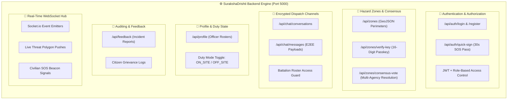

<div align="center">

<!-- Animated Header Wave -->


```text
 ███████╗██╗   ██╗██████╗  █████╗ ██╗  ██╗███████╗██╗  ██╗ █████╗ ██████╗ ██████╗ ██╗███████╗██╗  ██╗████████╗██╗
 ██╔════╝██║   ██║██╔══██╗██╔══██╗██║ ██╔╝██╔════╝██║  ██║██╔══██╗██╔══██╗██╔══██╗██║██╔════╝██║  ██║╚══██╔══╝██║
 ███████╗██║   ██║██████╔╝███████║█████╔╝ ███████╗███████║███████║██║  ██║██████╔╝██║███████╗███████║   ██║   ██║
 ╚════██║██║   ██║██╔══██╗██╔══██║██╔═██╗ ╚════██║██╔══██║██╔══██║██║  ██║██╔══██╗██║╚════██║██╔══██║   ██║   ██║
 ███████║╚██████╔╝██║  ██║██║  ██║██║  ██╗███████║██║  ██║██║  ██║██████╔╝██║  ██║██║███████║██║  ██║   ██║   ██║
 ╚══════╝ ╚═════╝ ╚═╝  ╚═╝╚═╝  ╚═╝╚═╝  ╚═╝╚══════╝╚═╝  ╚═╝╚═╝  ╚═╝╚═════╝ ╚═╝  ╚═╝╚═╝╚══════╝╚═╝  ╚═╝   ╚═╝   ╚═╝
```

### ⚙️ Scalable Node.js + Express 5 + Socket.io Disaster Decision Engine

<!-- Animated Dynamic Typing Banner -->


<br/>

[](https://nodejs.org/)
[](https://expressjs.com/)
[](https://postgresql.org/)
[](https://supabase.com/)
[](https://socket.io/)
[](https://jwt.io/)

</div>

---

## 🧭 Executive Overview

The **SurakshaDrishti Backend** is a fault-tolerant, low-latency command engine engineered for emergency mission operations. It serves as the single source of truth for:

- **Real-Time Spatial Ingestion:** High-speed ingest of ISRO SAR anomalies and IMD precipitation telemetry.
- **16-Digit Cryptographic Access Verification:** Guarantees that only authorized on-site commanders can join incident coordination.
- **Inter-Agency Consensus Voting:** Automatically transitions active Red Zones to "Situation Under Control" once consensus thresholds are met across NDRF, SDMA, and Police agencies.
- **QuickSign 30-Second Emergency Pass Tokens:** Issues authenticated, low-overhead civilian passes during sudden disasters without 2FA bottlenecks.
- **Low-Bandwidth GSM Telemetry:** Fallback ingestion pipeline for 140-byte emergency SMS packets when cellular internet data networks fail.

---

## 🛰️ Backend Architecture & Route Registry



### 1. Authentication Routes (`backend/routes/auth.js`)

- `POST /api/auth/register` — Role-based account creation (`RESIDENT`, `NDRF`, `SDMA`, `POLICE`).
- `POST /api/auth/login` — Issues signed JWT tokens with 7-day expiration.
- `POST /api/auth/quick-sign` — Rapid civilian evacuation pass generator with zero 2FA friction.
- `POST /api/auth/verify-otp` — SMTP / SMS one-time verification code validator.

### 2. Hazard Zone Routes (`backend/routes/zones.js`)

- `GET /api/zones` — Returns all active red zones, boundary GeoJSON perimeters, and assigned battalions.
- `POST /api/zones/verify-key` — Validates the 16-character passkey (`RZ-XXXX-XXXX-XXXX`) for officer incident enrollment.
- `POST /api/zones/consensus-vote` — Submits an officer's vote; resolves zone to safe status upon majority consensus.
- `POST /api/zones/ai-satellite-detect` — Webhook endpoint for automated deep learning hazard polygon detection.

### 3. Encrypted Dispatch Channels (`backend/routes/chat.js`)

- `GET /api/chat/conversations` — Retrieves agency-scoped encrypted chat rooms.
- `POST /api/chat/messages` — Stores encrypted message payloads and emits real-time WebSocket signals.

---

## 🗄️ Database Architecture (Supabase PostgreSQL 17.6)

The data tier maintains 11 relational tables connected via an SSL connection pool:

```text
backend/
├── handlers/
│   ├── dbHandler.js             # PostgreSQL connection pool & spatial queries
│   ├── middlewareHandler.js     # JWT verification, API rate-limiting & error handlers
│   └── aiAssistent.js           # Ollama & local AI inference helper
├── routes/
│   ├── auth.js                  # Authentication, OTP & QuickSign endpoints
│   ├── zones.js                 # Red zone perimeters & consensus resolution voting
│   ├── chat.js                  # E2EE inter-departmental dispatch messaging
│   ├── profile.js               # Duty mode toggle (ON_SITE / OFF_SITE) & badges
│   └── feedback.js              # Incident audits & citizen grievance filing
└── src/
    └── main.js                  # Express 5 server bootstrapper & Socket.io hub
```

---

## 🚀 Quick Start & Local Development

### 1. Prerequisites

- **Node.js**: `v18.0.0` or higher (v20+ recommended)
- **npm**: `v9.0.0` or higher
- **PostgreSQL**: PostgreSQL 16+ or active Supabase project credentials

### 2. Environment Configuration

Create a `.env` file inside `Website/backend/`:

```ini
PORT=5000
DATABASE_URL=postgresql://postgres:[PASSWORD]@[HOST]:[PORT]/postgres
JWT_SECRET=your_super_secret_jwt_key_here
SMTP_HOST=smtp.gmail.com
SMTP_PORT=587
EMAIL_USER=your_email@domain.com
EMAIL_PASS=your_app_password
```

### 3. Installation & Run

```bash
# Navigate to the backend directory
cd Website/backend

# Install dependencies
npm install

# Start the server
npm start
# or: node src/main.js
```

> ⚡ API Server and WebSocket listener launch on: **`http://localhost:5000`**

---

<div align="center">

<!-- Animated Footer Wave -->


**SurakshaDrishti Backend Engine**  
*SIH 2026 Problem Statement 26191 • Developed by ADAMAS University Team*

</div>
